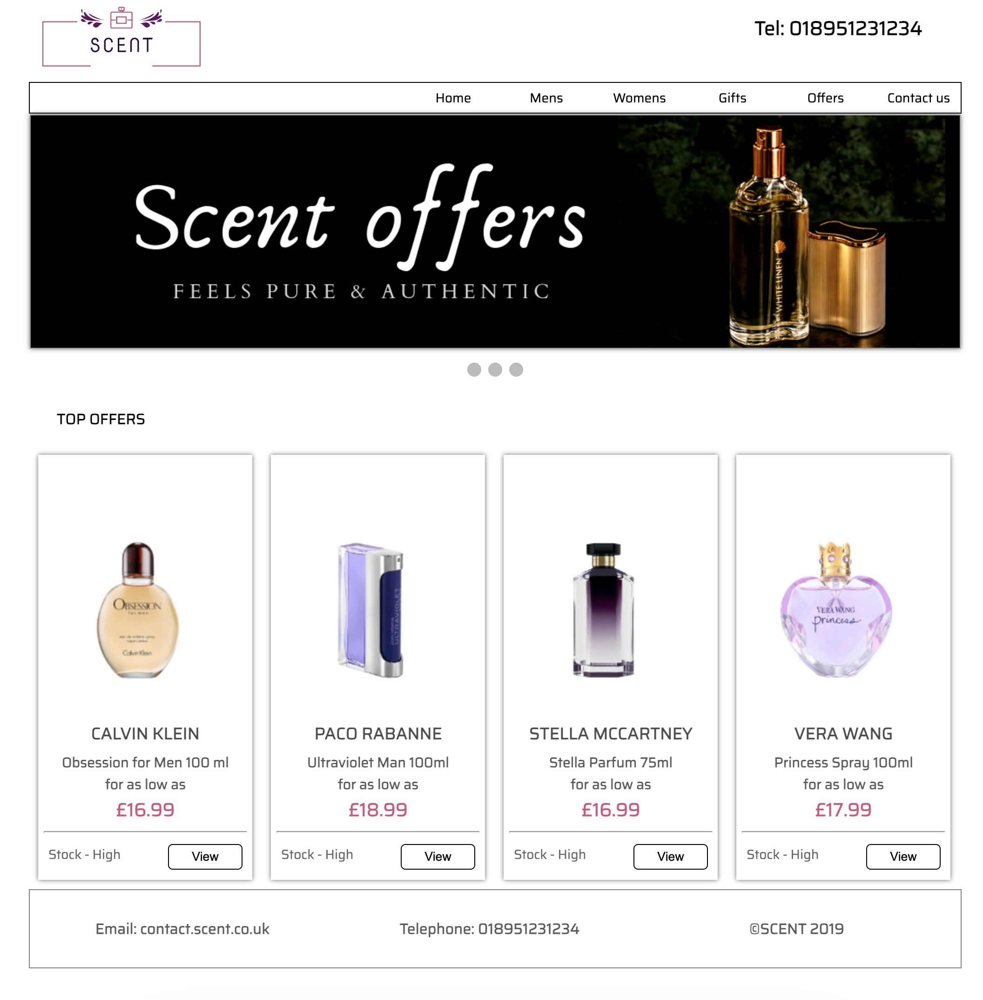
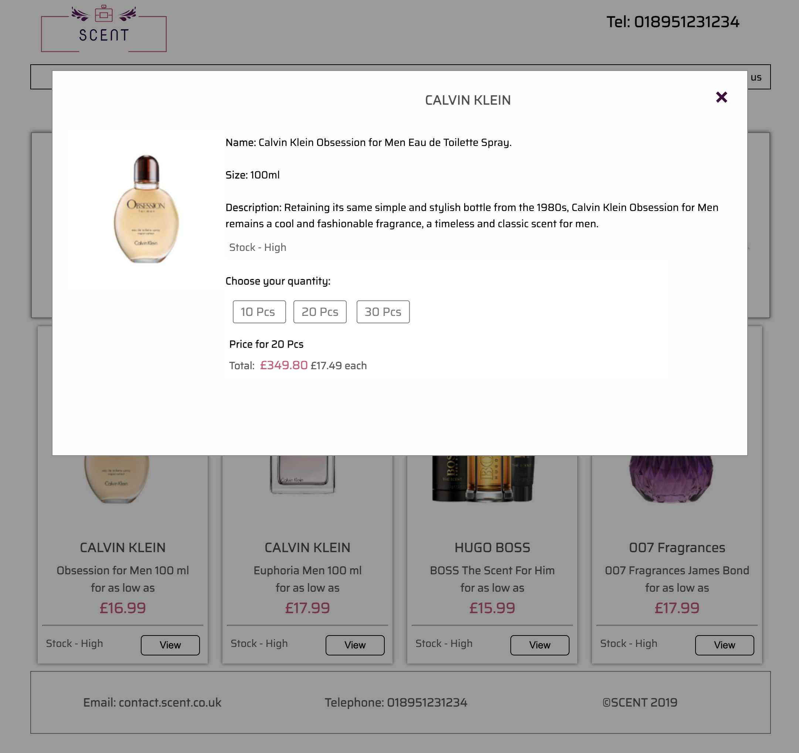
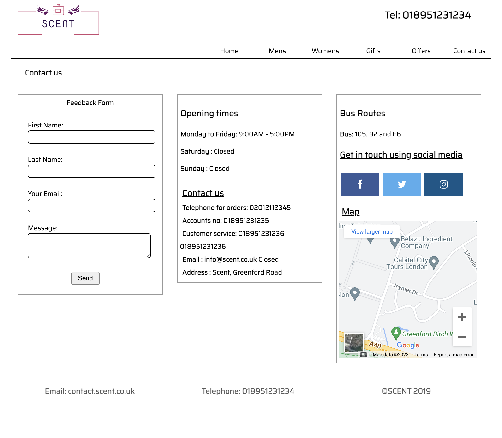

# Perfumes Wholesale Platform
Scent is an Academic project and its objective is to display prices according to the quantity chosen by the user and display the final price.

- **Visit** the website at: https://gsgghotra.github.io/perfumes_wholesale/

## Table of Contents
1. [Introduction](#introduction)
2. [Screenshots](#screenshots)
3. [Contact Information](#contact-information)

## Introduction
Scent is an Academic project and its objective is to display prices according to the quantity chosen by the user and display the final price. The project has the following objectives which are met successfully.

* Display prices according to the quantity chosen
    * Display the lowest price possible as the product price
    * Display the stock as High or Low
    * Display the product image and the correct product description
    * Contact us page with the interactive form and direction instructions
    * Consistent design and layout throughout the website

- **Technologies Used**: HTML, CSS, JavaScript

## Screenshots
- **Home Screen**:

- **Offer Page**:

- **Product Info**:

- **Contact us Page**:

## Contact Information

- **Email**: gsgghotra@gmail.com
- **LinkedIn**: [gsgghotra](https://www.linkedin.com/in/gsgghotra/)